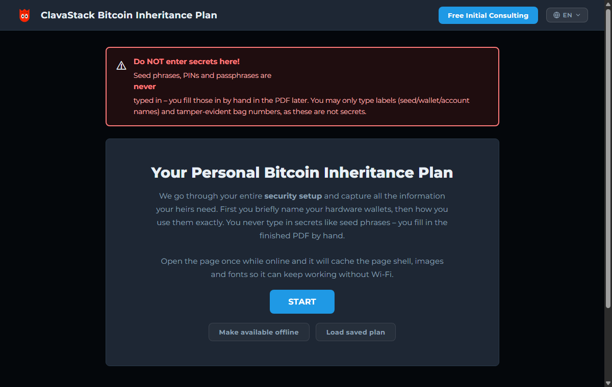
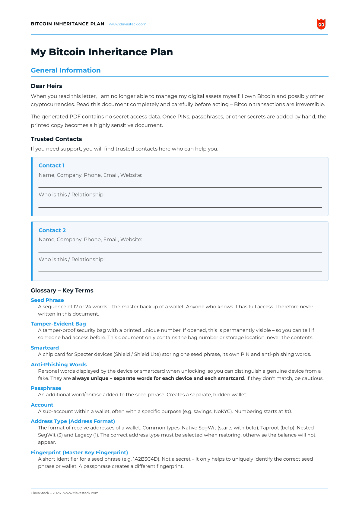
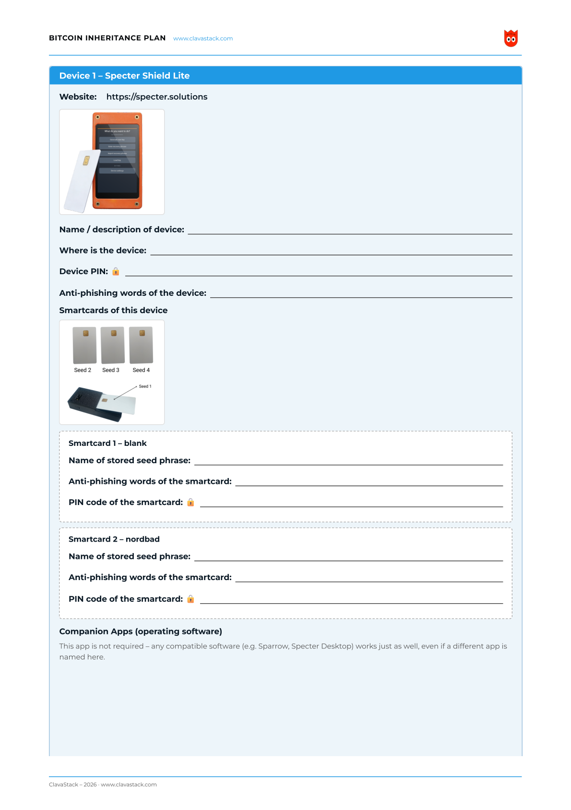

# ClavaStack – Bitcoin Inheritance Plan Tool

A single-file, self-contained browser tool that walks Bitcoin holders through a structured
**inheritance plan** and turns it into a print-ready **PDF** (via the browser's print function).
A functional clone of the Marc Steiner inheritance-plan tool, styled with **Specter** branding and
the **ClavaStack** logo. The app itself is fully bilingual (EN/DE, switchable in the header).

## Usage

1. Open `index.html` in a browser (Chrome recommended) – no server, no build step required.
2. Fill out the wizard. Sections/devices you don't need can simply be toggled off.
3. Click **"Create PDF"** → the browser's print dialog opens.
4. Choose **"Save as PDF"** as the destination. Also works with the **"Margins: None"** print
   setting.

## Features

- **Modular wizard** – only the sections/devices you select end up in the PDF:
  - General information + up to 2 trusted contacts (contact details and a relationship note are
    captured directly in the wizard; empty fields remain a blank handwriting line in the PDF)
  - Hardware wallets (dynamic, with a 24-word seed grid per device)
  - Software wallets (computer & smartphone)
  - Online exchanges, incl. 2FA device
  - Password manager app
  - Multisig wallet (with co-signers)
- **Password-protected save & load** – wizard input can be saved as an **encrypted** file at the
  end and reloaded later to continue. Encryption uses **AES-256-GCM** (key derivation via
  PBKDF2-SHA256 from a self-chosen password, through the Web Crypto API). The password is
  requested on save (with confirmation) and on load; a wrong password fails cleanly. Older,
  unencrypted plan files can still be loaded. *Without the password there is no recovery – keep the
  file and password safe/offline.*
- **Predefined device/exchange lists** with automatic filling of the official URLs.
- **Automatic quick-overview table** built from all entries.
- **Print-optimized PDF layout**: a running header (colored ClavaStack logo + URL) and footer
  (branding + page number) on every page, even margins on all four sides, no
  cut-off/overlapping content from page 2 onward (thead/tfoot spacer technique).

## What the PDF looks like

The generated document never contains secrets – seed phrases, PINs and passwords stay as blank
handwriting lines, filled in by hand only after printing.

## Project layout

| File | Purpose |
|------|---------|
| `index.html` | Complete app (HTML, CSS, vanilla JS) – self-contained, logo embedded as base64 |
| `sw.js` / `site.webmanifest` | Service worker + PWA manifest for offline mode ("Make available offline") |
| `assets/clavastack-logo.png` | ClavaStack logo (source) |
| `.github/workflows/sync-to-clavastack.yml` | CI: mirrors `index.html` to the ClavaStack website on every push |
| `.gitignore` | OS/editor artifacts |

No external dependencies besides the Google Fonts link (Montserrat).

## Live version

The current `index.html` runs live at **[clavastack.com/inheritance-planner](https://clavastack.com/inheritance-planner)**
(auto-synced on every push, see the CI workflow above).

## Security notice

This document contains highly sensitive data (PINs, passwords, seed phrases) once filled in by
hand. Only fill it out on a trusted device, save/print it offline, and store printouts securely.

## License

Licensed under the [Common Public Attribution License 1.0 (CPAL-1.0)](LICENSE). Unlike a
plain MIT/Apache license, CPAL contractually requires visible attribution: if you embed,
redistribute, or build on this tool — including on your own website — [Exhibit B of the
LICENSE](LICENSE) requires the single word **"ClavaStack"**, prominently and legibly
displayed in the user interface, as an active hyperlink to https://clavastack.com. No logo
or additional wording is required — but it must be there, not buried in a source file or
credits page.
